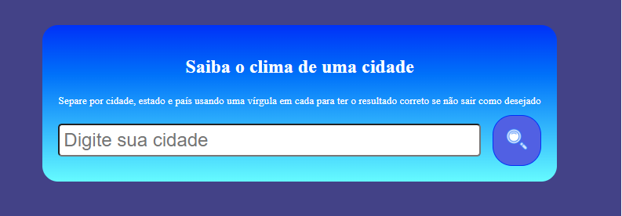
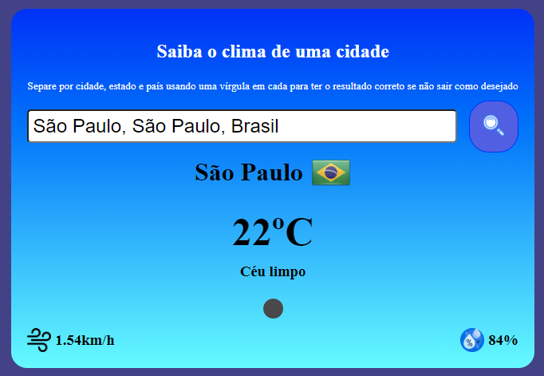
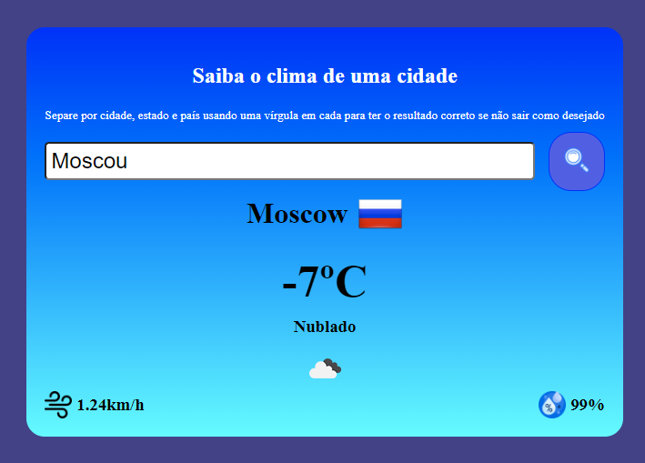
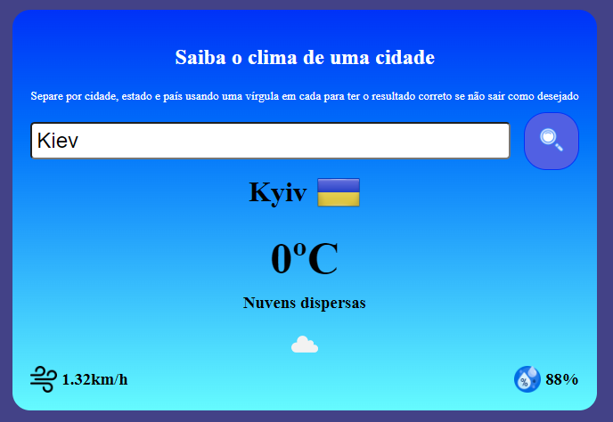

# Aplicação básica que consome uma API de clima

Nesse projetinho há um campo da qual você digita o nome da cidade, e se possível siga o padrão de `City, State, Country` para conseguir resultados precisos e sem erros.

O consumo da API é feito com uso da biblioteca `axios()` para fazer a requisição HTTP.

Assim que o nome da cidade for digitado e o usuário clicar no botão do lado, a API retornará esses dados abaixo:

* Nome da cidade (novamente)
* Bandeira do país
* Temperatura
* Umidade
* Velocidade do vento

###[Link externo para testar](https://showweatherinfo.netlify.app/)

A API key desse projeto é gratuita, então não há problema em deixa-lá pública. Você pode baixar esse projeto e executar no seu próprio dispotivo se quiser usar uma key diferente. Abra o arquivo `script.js` e altere a seguinte linha abaixo:

```js
const API_key = "" //Coloque sua chave API dentro das aspas;
```
Você pode obter uma chave gratuitamente fazendo um cadastro [-->AQUI<--](https://openweathermap.org/api), e depois copiando e colando no local que eu indiquei.
Sem essa key, você obterá o código de erro **401 Unauthorized**.
 
---

# INTERFACE INICIAL



# RESULTADO 1


# RESULTADO 2


# RESULTADO 3


**O resultado não é 100% preciso, mas é extremamente próximo e te dá uma noção sobre como está o clima geral na região X ou Y.**

**O projeto embora seja bem simples, tem a finalidade de servir como um treino para o consumo de APIs. Nesse caso ela foi consumida via Front-end.**

